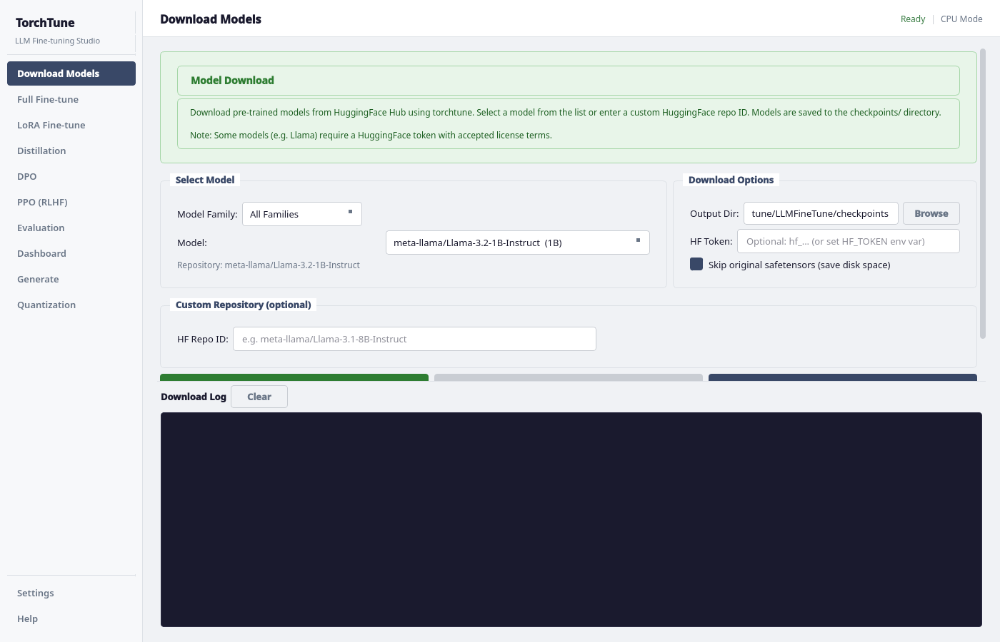
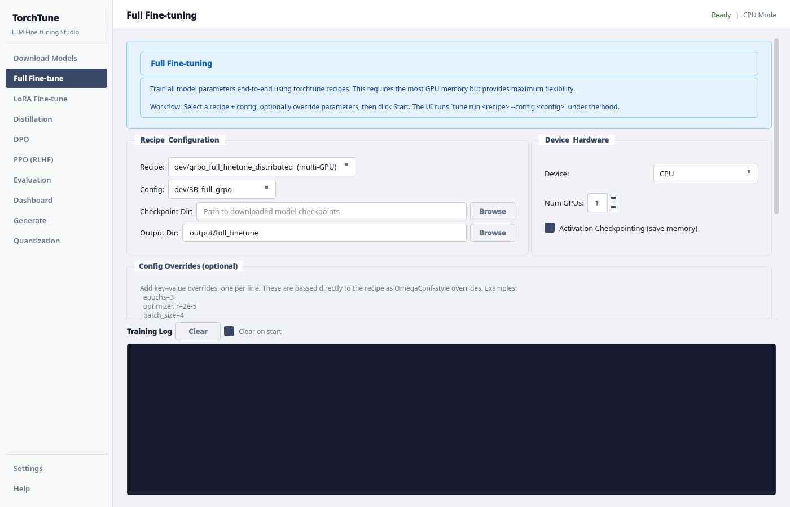
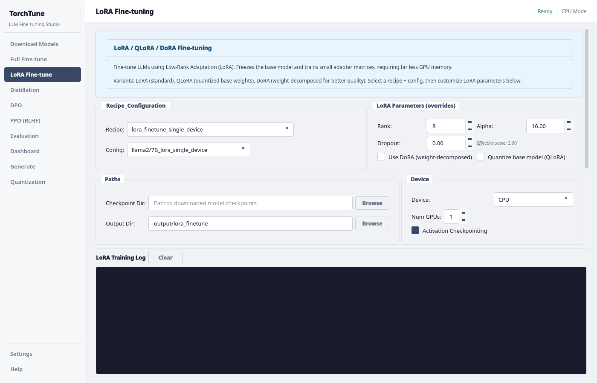
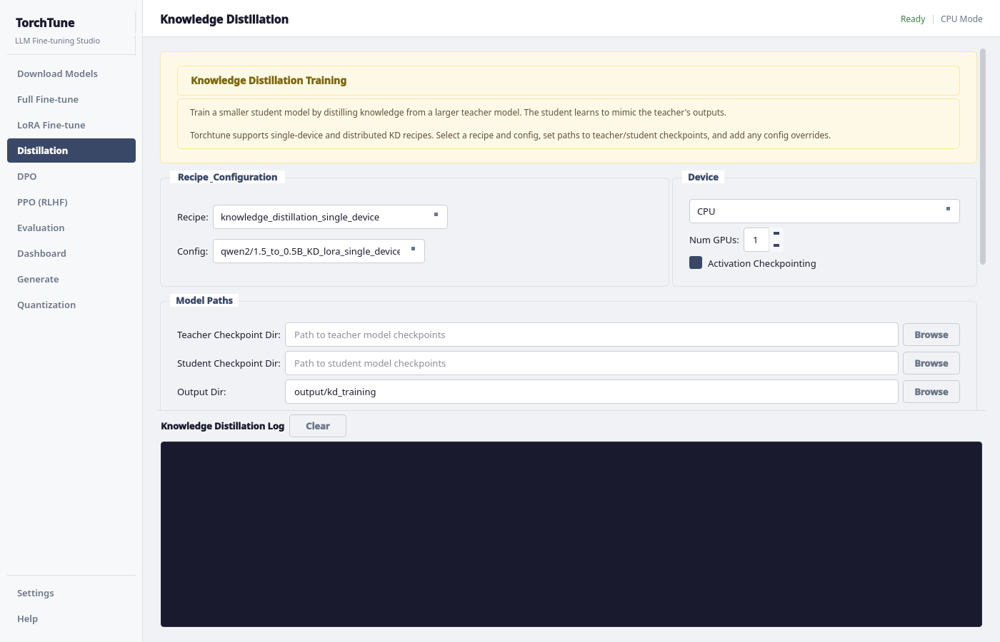
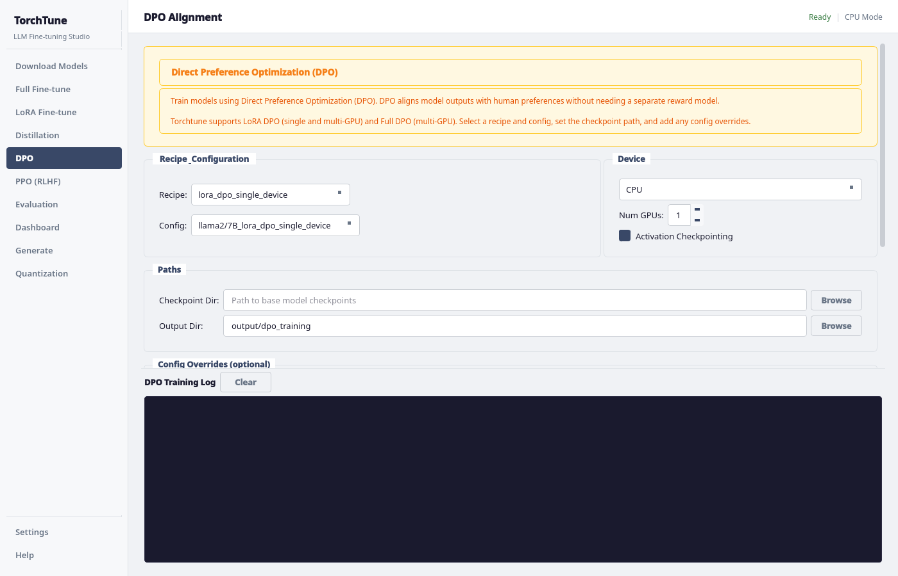
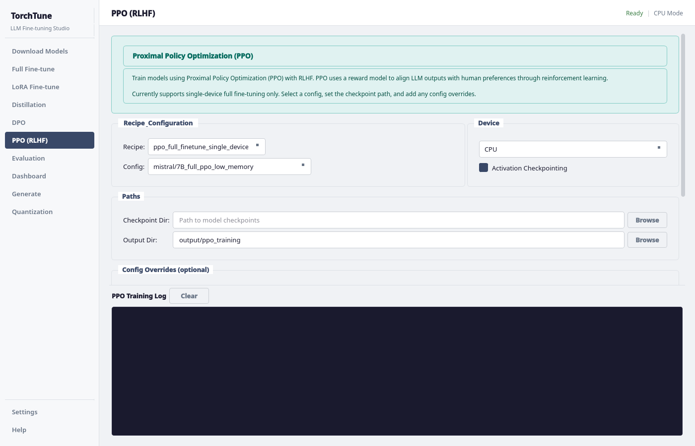
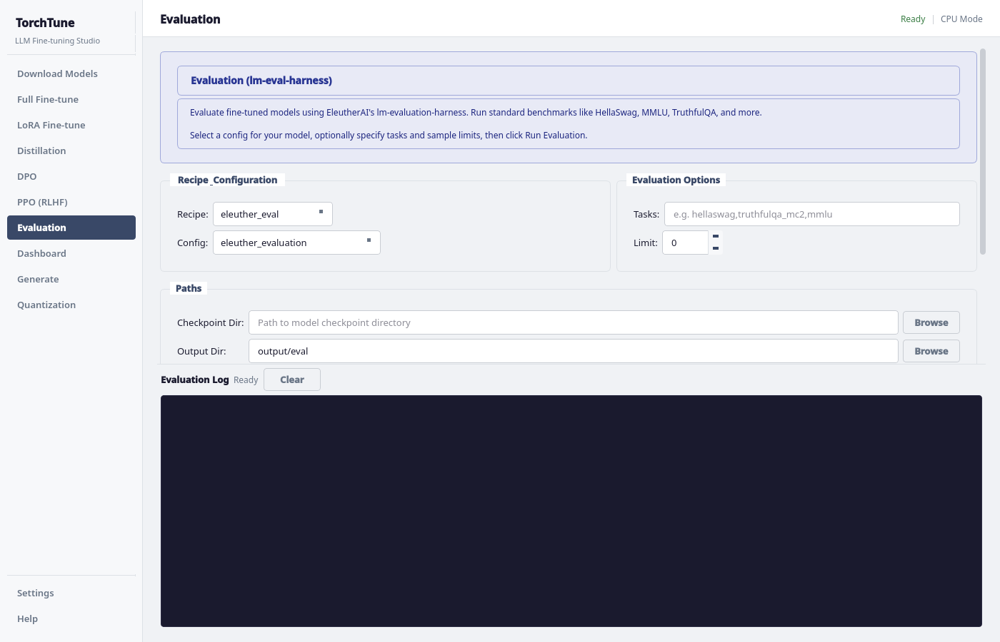
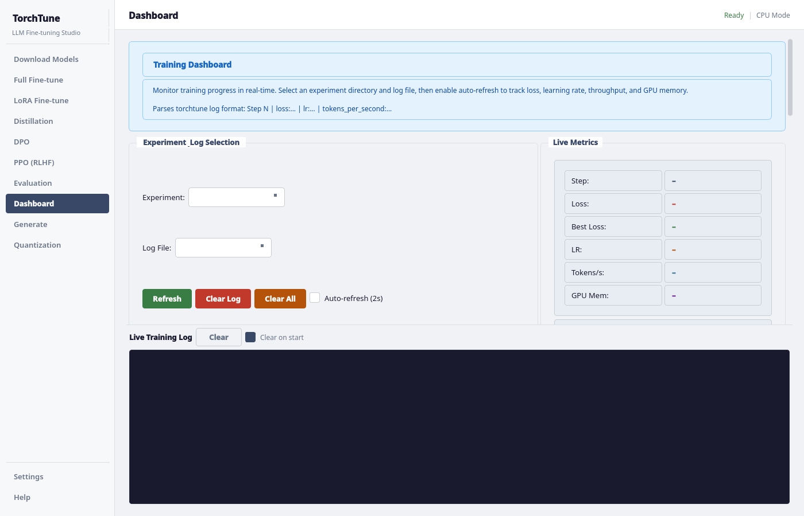
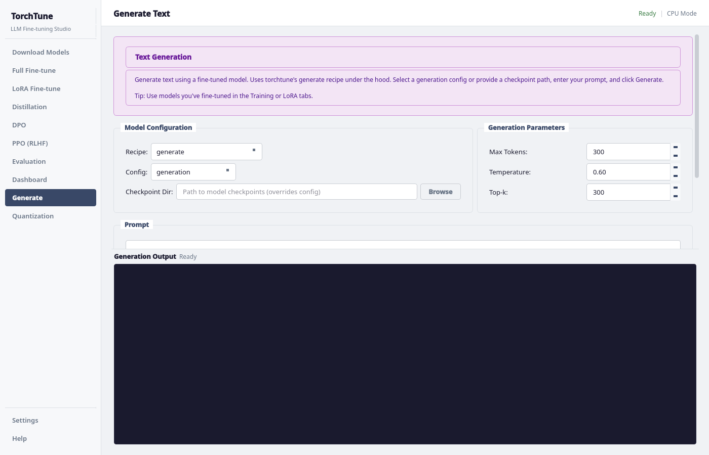
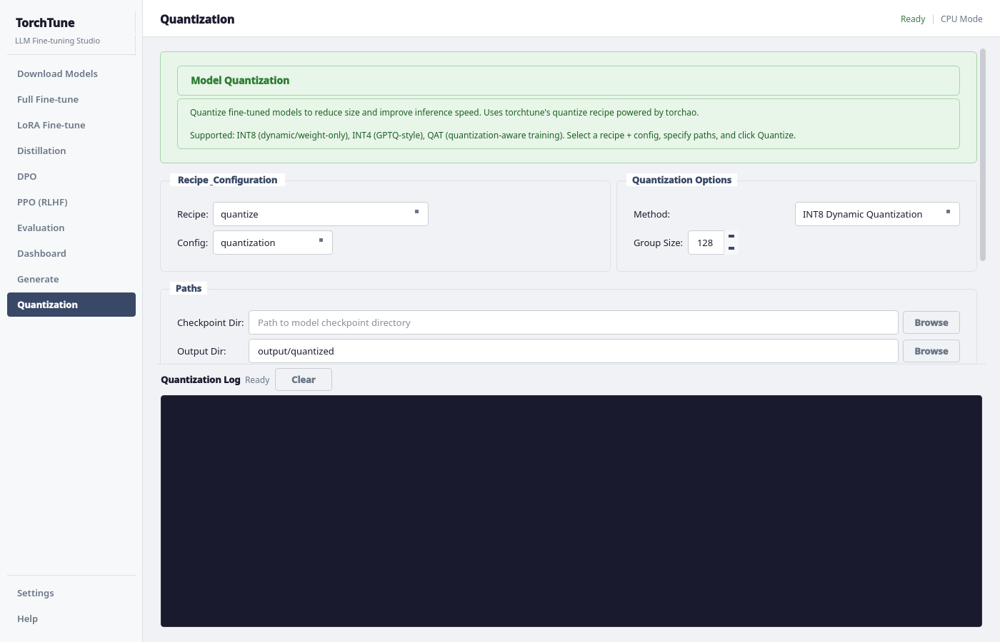

# TorchTune LLM Fine-Tuning Studio

A desktop GUI application for fine-tuning, evaluating, and deploying large language models using [torchtune](https://github.com/pytorch/torchtune). Built with PyQt5, it wraps the `tune` CLI into an intuitive visual interface — no command-line expertise needed.

[](https://www.python.org/)
[](https://riverbankcomputing.com/software/pyqt/)
[](https://github.com/pytorch/torchtune)
[](LICENSE)

---

## Features

| Feature | Description |
|---------|-------------|
| **Download Models** | Download models from Hugging Face Hub via `tune download` |
| **Full Fine-tuning** | Single-device and distributed full parameter training |
| **LoRA / QLoRA / DoRA** | Memory-efficient adapter-based fine-tuning |
| **Knowledge Distillation** | Teacher-student knowledge transfer |
| **DPO Alignment** | Direct Preference Optimization for alignment |
| **PPO (RLHF)** | Proximal Policy Optimization reinforcement learning |
| **Evaluation** | EleutherAI LM Evaluation Harness integration |
| **Training Dashboard** | Real-time loss, LR, throughput, and GPU memory charts |
| **Text Generation** | Interactive inference with fine-tuned models |
| **Quantization** | Post-training quantization (INT8 / INT4) |

---

## Screenshots

### Download Models


### Full Fine-tuning


### LoRA Fine-tuning


### Knowledge Distillation


### DPO Alignment


### PPO (RLHF)


### Evaluation


### Training Dashboard


### Text Generation


### Quantization


---

## Supported Models

| Model | Sizes |
|-------|-------|
| Llama 4 | Scout (17B x 16E) |
| Llama 3.3 | 70B |
| Llama 3.2 Vision | 11B, 90B |
| Llama 3.2 | 1B, 3B |
| Llama 3.1 | 8B, 70B, 405B |
| Llama 3 | 8B, 70B |
| Llama 2 | 7B, 13B, 70B |
| Mistral | 7B |
| Gemma 2 | 2B, 9B, 27B |
| Phi-4 | 14B |
| Phi-3 | Mini |
| Qwen 3 | 0.6B, 1.7B, 4B, 8B, 14B, 32B |
| Qwen 2.5 | 0.5B - 72B |
| Qwen 2 | 0.5B, 1.5B, 7B |

---

## Project Structure

```
LLMFineTune/
├── ui/                          # Desktop GUI application
│   ├── main.py                  # Application entry point
│   ├── styles.py                # Unified theme & color constants
│   ├── helpers.py               # CLI wrapper utilities
│   ├── requirements.txt         # UI-specific dependencies
│   ├── tabs/                    # One module per feature tab
│   │   ├── download_tab.py
│   │   ├── training_tab.py      # Full fine-tuning
│   │   ├── lora_tab.py          # LoRA / QLoRA / DoRA
│   │   ├── kd_tab.py            # Knowledge distillation
│   │   ├── dpo_tab.py           # DPO alignment
│   │   ├── ppo_tab.py           # PPO (RLHF)
│   │   ├── eval_tab.py          # Evaluation
│   │   ├── dashboard_tab.py     # Training dashboard
│   │   ├── inference_tab.py     # Text generation
│   │   └── quantization_tab.py  # Post-training quantization
│   └── widgets/                 # Reusable UI components
├── torchtune/                   # torchtune library (local copy)
│   ├── _cli/                    # CLI commands (tune run, download, ls)
│   ├── config/                  # YAML config parsing
│   ├── data/                    # Data processing & tokenization
│   ├── datasets/                # Dataset loaders
│   ├── models/                  # Model architectures
│   ├── modules/                 # LoRA, attention, loss functions
│   ├── rlhf/                    # DPO / PPO losses and rewards
│   ├── training/                # Training utilities & checkpointing
│   └── generation/              # Text generation utilities
├── screenshots/                 # UI screenshots
├── requirements.txt             # Project dependencies
├── LICENSE                      # BSD 3-Clause License
└── README.md
```

---

## Installation

### Prerequisites

- Python 3.9+
- PyTorch 2.0+ (with CUDA for GPU training)
- A Hugging Face account (for model downloads)

### Setup

```bash
# Clone the repository
git clone https://github.com/Gaurav14cs17/LLMFineTune.git
cd LLMFineTune

# Create a virtual environment (recommended)
python -m venv venv
source venv/bin/activate  # Linux/Mac
# venv\Scripts\activate   # Windows

# Install PyTorch (with CUDA support)
pip install torch torchvision torchao

# Install all dependencies
pip install -r requirements.txt
```

### Verify installation

```bash
python -c "import torchtune; print('torchtune OK')"
python -c "from PyQt5.QtWidgets import QApplication; print('PyQt5 OK')"
```

---

## Usage

### Launch the GUI

```bash
cd ui
python main.py
```

### Quick Workflow

1. **Download** — Select a model from the dropdown or enter a Hugging Face model ID, click Download.
2. **Fine-tune** — Pick a training tab (Full, LoRA, DPO, etc.), select a recipe + config, set paths, click Start.
3. **Monitor** — Dashboard auto-activates during training with live charts for loss, LR, throughput, and GPU memory.
4. **Evaluate** — Run benchmarks via the Evaluation tab using EleutherAI's LM Evaluation Harness.
5. **Generate** — Test your fine-tuned model interactively in the Generate tab.
6. **Quantize** — Compress model weights with INT8/INT4 quantization.

### CLI Usage (without GUI)

```bash
# Download a model
python -m torchtune._cli.tune download meta-llama/Meta-Llama-3.1-8B-Instruct \
  --output-dir ./checkpoints/llama3.1-8B

# LoRA fine-tune
python -m torchtune._cli.tune run lora_finetune_single_device \
  --config llama3_1/8B_lora_single_device

# Distributed full fine-tune (2 GPUs)
python -m torchtune._cli.tune run --nproc_per_node 2 \
  full_finetune_distributed --config llama3_1/8B_full

# Evaluate
python -m torchtune._cli.tune run eleuther_eval \
  --config eleuther_evaluation tasks=["hellaswag"]

# Quantize
python -m torchtune._cli.tune run quantize --config quantization
```

---

## Training Recipes

| Recipe | Single Device | Distributed |
|--------|:---:|:---:|
| Full Fine-tuning | Yes | Yes |
| LoRA / QLoRA / DoRA | Yes | Yes |
| Knowledge Distillation | Yes | Yes |
| DPO (Full) | No | Yes |
| DPO (LoRA) | Yes | Yes |
| PPO (Full) | Yes | No |
| Evaluation | Yes | No |
| Generation | Yes | Yes |

---

## Memory & Performance

Benchmarks with Llama 3.1 8B (batch size 2, seq len 2048, torch compile):

| Method | GPU | Peak Memory | Tokens/sec |
|--------|-----|------------|------------|
| Full Fine-tune | 1x 4090 | 18.9 GiB | 1,650 |
| Full Fine-tune | 1x A6000 | 37.4 GiB | 2,579 |
| LoRA | 1x 4090 | 16.2 GiB | 3,083 |
| LoRA | 1x A6000 | 30.3 GiB | 4,699 |
| QLoRA | 1x 4090 | 7.4 GiB | 2,413 |

---

## License

This project is released under the [BSD 3-Clause License](LICENSE).

## Acknowledgements

Built on [torchtune](https://github.com/pytorch/torchtune) by Meta/PyTorch.

Integrations: [Hugging Face Hub](https://huggingface.co/), [EleutherAI LM Eval Harness](https://github.com/EleutherAI/lm-evaluation-harness), [torchao](https://github.com/pytorch/ao), [Weights & Biases](https://wandb.ai/).
